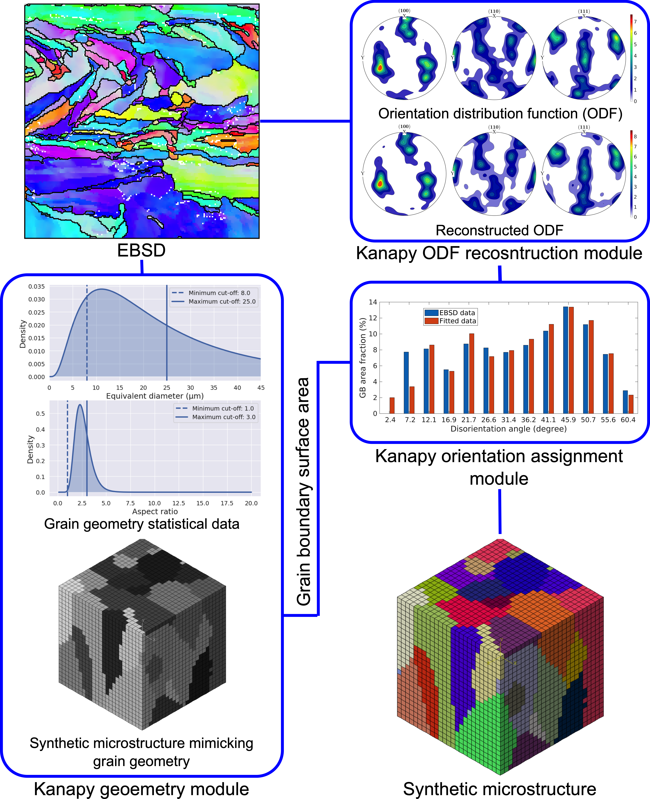

[](https://doi.org/10.21105/joss.01732)
[](https://doi.org/10.5281/zenodo.3662366)

[](https://www.gnu.org/licenses/agpl-3.0.html)

Kanapy is a python package for generating complex three-dimensional (3D) synthetic
polycrystalline microstructures that are built based on statistical information about grain geometry, given as grain size distribution and aspect ratio of grains, and crystallographic texture, given in form of orientation distribution functions (ODF) and misorientation distribution functions (MDF). Kanapy offers tools to analyze the geometry and texture of microstructures given by EBSD maps to generate 3D synthetic microstructures mimicking real ones in a statistical sense. The
implementation is done in [Python](http://www.python.org).  

The texture module of Kanapy is implemented as
[MATLAB](https://www.mathworks.com/products/matlab.html) functions using several algorithms implemented in
[MTEX](https://mtex-toolbox.github.io/) for texture analysis.



# Features

-   Kanapy offers a Python Application Programming Interface (API) and can also be used through a Command Line Interface (CLI).
-   Possibility to analyze experimental microstructures based on [MTEX](https://mtex-toolbox.github.io/) functions.
-   Generation of microstructure geometry based on statistical features as grain size distribution and grain aspect ratio distribution.
-   Crystallographic texture reconstruction using orientations from
    experimental data in form of Orientation Distribution Function (ODF).
-   Optimal orientation assignment based on measured Misorientation Distribution Function (MDF) that maintains correct statistical description of high-angle or low-angle grain boundary characteristics.
-   Independent execution of individual modules through easy data
    storage and handling.
-   In-built hexahedral mesh generator for complex polycrystalline
    microstructures.
-   Efficient generation of space filling structures by particle dynamics method.
-   Collision handling of particles through a two-layer
    collision detection method employing the Octree spatial data
    structure and the bounding sphere hierarchy.
-   Option to generate spherical particle position- and radius files
    that can be read by the Voronoi tessellation software
    [Neper](http://neper.sourceforge.net/).
-   Option to generate input files for the commercial finite-element
    software
    [Abaqus](https://www.3ds.com/products-services/simulia/products/abaqus/)

# Installation

The preferred method to install kanapy is through Anaconda or Miniconda
Python distributions. If you do not have any, we suggest installing
[miniconda](https://docs.conda.io/en/latest/miniconda.html).

Once done, clone the repository to a desired location, create a conda
environment for the Kanapy installation and install.

```
$ git clone https://github.com/ICAMS/Kanapy.git ./kanapy
$ cd kanapy
$ conda env create -f environment.yml
$ conda activate knpy
(knpy) $ python -m pip install .
```

Kanapy is now installed along with all its dependencies. If you intend
to use Kanapy's texture module, a
[MATLAB](https://www.mathworks.com/products/matlab.html) installation is required because the texture module is based on [MTEX](https://mtex-toolbox.github.io/) functions. Kanapy uses a local version of MTEX stored in libs/mtex, if you want to use another version, please set the paths accordingly. If MATLAB is available on your system, the texture module is initialized by the command

``` 
(knpy) $ kanapy setupTexture
```

**Note:** The installation scripts have been tested for Matlab R2023a with Python 3.9.16. If you are using other Matlab versions, the script "setupTexture" might fail. In that case, you can setup the Matlab Engine API for Python manually. To do so, please follow the instructions given on the [Mathworks&reg;](https://de.mathworks.com/help/matlab/matlab_external/install-the-matlab-engine-for-python.html) website, to (i) Verify your configuration, (ii) Install Engine API, and (iii) Start MATLAB Engine. The Python version of the *knpy*-environment can be changed according to the requirements of the Matlab Engine API by editing the "environment.yml" file and re-creating the conda environment *knpy*.

# Running tests

Kanapy uses pytest to perform all its unit testing. Run

```
(knpy) $ kanapy runTests          
```

to verify the correct installation of Kanapy.   

**Note:** If the texture module (test\_texture.py) fails the test, the cause lies oftentimes in a wrong MATLAB path. Please run "\$ matlab startup_mtex.m" in the directory "libs/mtex" to fix that problem.

# Documentation

Open "kanapy/docs/index.html" in a browser to access the complete documentation for kanapy.

The documentation is also available online on GitHub Pages: [https://icams.github.io/Kanapy/](https://icams.github.io/Kanapy/)

The documentation for kanapy is generated using [Sphinx](http://www.sphinx-doc.org/en/master/). You can create or update your local documentation with the command

```
(knpy) $ kanapy genDocs                    
```

The updated HTML documentation can then be found under
"kanapy/docs/builds/html".

**Note:** Documentation requires Read the Docs Sphinx Theme which can be installed via "$ pip install sphinx-rtd-theme".

# Dependencies

Kanapy's texture module requires
[MATLAB](https://www.mathworks.com/products/matlab.html) to be installed on your machine. Make sure to use MATLAB v2015a and above. The module uses a local version of [MTEX](https://mtex-toolbox.github.io/) contained in *kanapy/libs* and does not interfere with other installations of MTEX.

### Core dependencies

Below are the listed dependencies for running kanapy:

> -   [NumPy](http://numpy.scipy.org) for array manipulation.
> -   [Scipy](https://www.scipy.org/) for functionalities like
>     Convexhull.
> -   [pytest](https://www.pytest.org) for running kanapy unit tests.
> -   [sphinx](http://www.sphinx-doc.org/en/master/) for generating
>     documentation.
> -   [MATLAB](https://www.mathworks.com/products/matlab.html) for
>     texture module.
> -   [MTEX](https://mtex-toolbox.github.io/) for texture module.

### Optional dependencies

> -   [Matplotlib](https://matplotlib.org/) for plotting and
>     visualizing.
> -   [OVITO](https://ovito.org/) for visualizing simulation data.


# Citation

The preferred way to cite Kanapy is:

``` bibtex
@article{Biswas2020,
  doi = {10.5281/zenodo.3662366},
  url = {https://doi.org/10.5281/zenodo.3662366},
  author = {Abhishek Biswas and Mahesh R.G. Prasad and Napat Vajragupta and Alexander Hartmaier},
  title = {Kanapy: Synthetic polycrystalline microstructure generator with geometry and texture},
  journal = {Zenodo},
  year = {2020}
}
```

# Related works and applications

-   Prasad et al., (2019). Kanapy: A Python package for generating
    complex synthetic polycrystalline microstructures. Journal of Open
    Source Software, 4(43), 1732. <https://doi.org/10.21105/joss.01732>
-   Biswas, Abhishek, R.G. Prasad, Mahesh, Vajragupta, Napat, &
    Hartmaier, Alexander. (2020, February 11). Kanapy: Synthetic
    polycrystalline microstructure generator with geometry and texture
    (Version v2.0.0). Zenodo. <http://doi.org/10.5281/zenodo.3662366>
-   Biswas, A., Prasad, M.R.G., Vajragupta, N., ul Hassan, H., Brenne,
    F., Niendorf, T. and Hartmaier, A. (2019), Influence of
    Microstructural Features on the Strain Hardening Behavior of
    Additively Manufactured Metallic Components. Adv. Eng. Mater.,
    21: 1900275. <http://doi.org/10.1002/adem.201900275>
-   Biswas, A., Vajragupta, N., Hielscher, R. & Hartmaier, A. (2020). J.
    Appl. Cryst. 53, 178-187.
    <https://doi.org/10.1107/S1600576719017138>
-   Biswas, A., Prasad, M.R.G., Vajragupta, N., Kostka, A., Niendorf, T.
    and Hartmaier, A. (2020), Effect of Grain Statistics on
    Micromechanical Modeling: The Example of Additively Manufactured
    Materials Examined by Electron Backscatter Diffraction. Adv. Eng.
    Mater., 22: 1901416. <http://doi.org/10.1002/adem.201901416>
-   R.G. Prasad, M., Biswas, A., Geenen, K., Amin, W., Gao, S., Lian,
    J., Röttger, A., Vajragupta, N. and Hartmaier, A. (2020), Influence
    of Pore Characteristics on Anisotropic Mechanical Behavior of Laser
    Powder Bed Fusion--Manufactured Metal by Micromechanical Modeling.
    Adv. Eng. Mater., <https://doi.org/10.1002/adem.202000641>

# License

Kanapy is made available under the GNU AGPLv3
[license](https://www.gnu.org/licenses/agpl-3.0.html).

# About

The name kanapy is derived from the sanskrit word
[káṇa](https://en.wiktionary.org/wiki/%E0%A4%95%E0%A4%A3) meaning
particle. Kanapy is primarily developed at the [Interdisciplinary Center
for Advanced Materials Simulation (ICAMS), Ruhr-University Bochum -
Germany](http://www.icams.de/content/). Our goal is to build a complete
synthetic microstructure generation tool for research and industry use.

# Authors

Mahesh R.G Prasad, Abhishek Biswas, Golsa Tolooei Eshlaghi, Napat Vajragupta, Alexander Hartmaier  
[ICAMS](http://www.icams.de/content/) / [Ruhr-Universität Bochum](https://www.ruhr-uni-bochum.de/en), Germany 


# Disclaimer

THIS SOFTWARE IS PROVIDED BY THE COPYRIGHT HOLDERS AND CONTRIBUTORS "AS
IS" AND ANY EXPRESS OR IMPLIED WARRANTIES, INCLUDING, BUT NOT LIMITED
TO, THE IMPLIED WARRANTIES OF MERCHANTABILITY AND FITNESS FOR A
PARTICULAR PURPOSE ARE DISCLAIMED. IN NO EVENT SHALL THE COPYRIGHT
HOLDER OR CONTRIBUTORS BE LIABLE FOR ANY DIRECT, INDIRECT, INCIDENTAL,
SPECIAL, EXEMPLARY, OR CONSEQUENTIAL DAMAGES (INCLUDING, BUT NOT LIMITED
TO, PROCUREMENT OF SUBSTITUTE GOODS OR SERVICES; LOSS OF USE, DATA, OR
PROFITS; OR BUSINESS INTERRUPTION) HOWEVER CAUSED AND ON ANY THEORY OF
LIABILITY, WHETHER IN CONTRACT, STRICT LIABILITY, OR TORT (INCLUDING
NEGLIGENCE OR OTHERWISE) ARISING IN ANY WAY OUT OF THE USE OF THIS
SOFTWARE, EVEN IF ADVISED OF THE POSSIBILITY OF SUCH DAMAGE.
